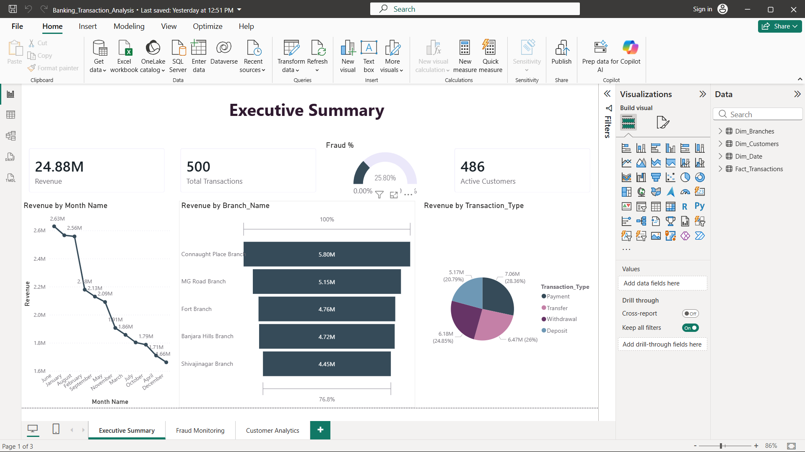
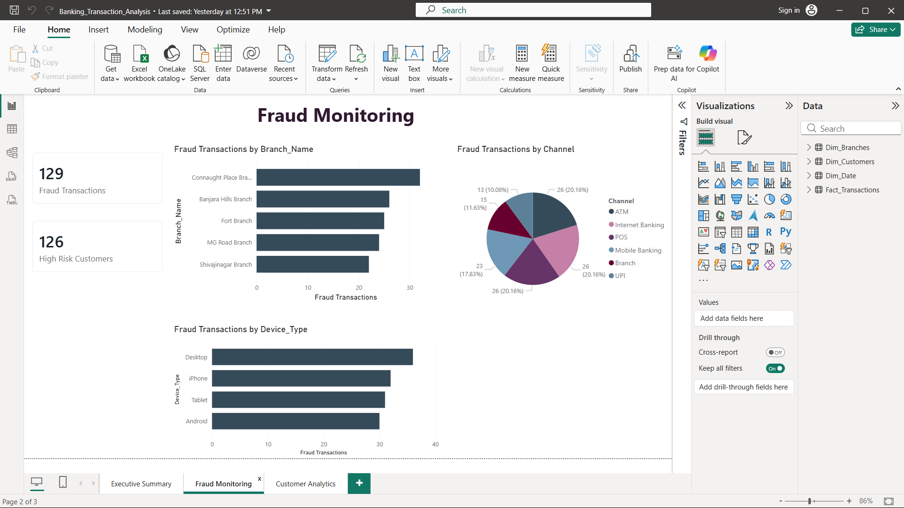
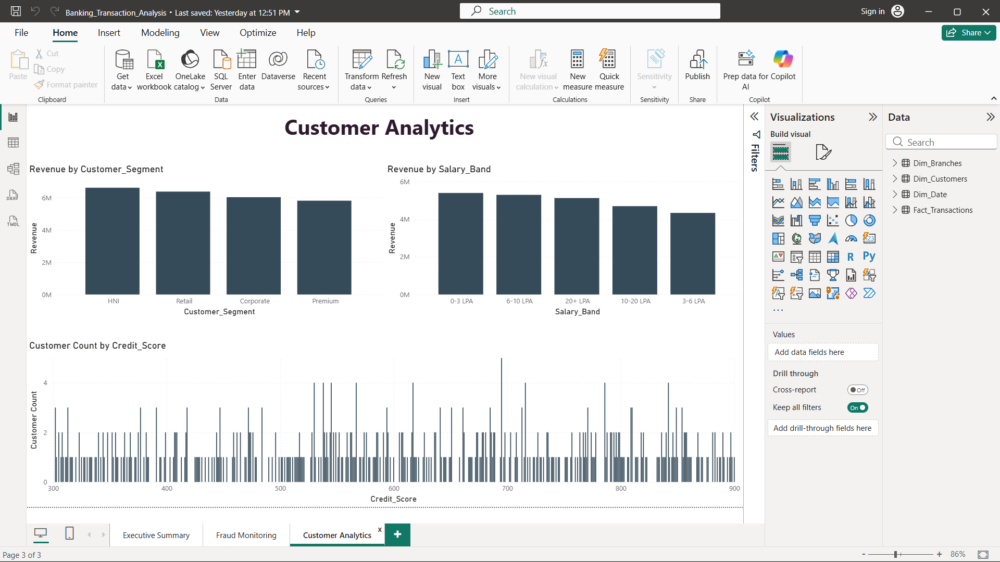
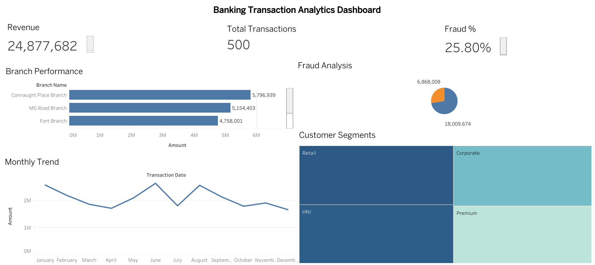

# Banking_Transaction_Analysis

## Project Overview

Developed an end-to-end banking analytics solution using:

- SQL Server
- Python
- Excel
- Power BI
- Tableau

The objective was to analyze transaction patterns, identify fraud-risk transactions, monitor branch performance, and generate executive dashboards.

---

## Tools Used

- SQL Server Management Studio
- Python (Pandas, NumPy, Matplotlib)
- Excel
- Power BI
- Tableau

---

## Dataset

450+ banking transactions.

Key Fields:

- Customer ID
- Transaction ID
- Amount
- Branch
- Transaction Type
- Fraud Flag
- Risk Score
- Customer Segment

---

## SQL Analysis

- Stored Procedures
- Views
- CTEs
- Window Functions

---

## Python Analysis

- Data Cleaning
- Trend Analysis
- Fraud Analysis
- Visualizations

---

## Power BI Dashboard

- Executive Summary with Revenue KPIs

- Fraud Monitoring

  

- Customer Analytics

---

## Tableau Dashboard

- Branch Performance
- Monthly Trends
- Customer Segmentation

---

## Key Insights

- Top Revenue Branches
- High-Risk Customers
- Fraud Transactions
- Customer Spending Patterns
